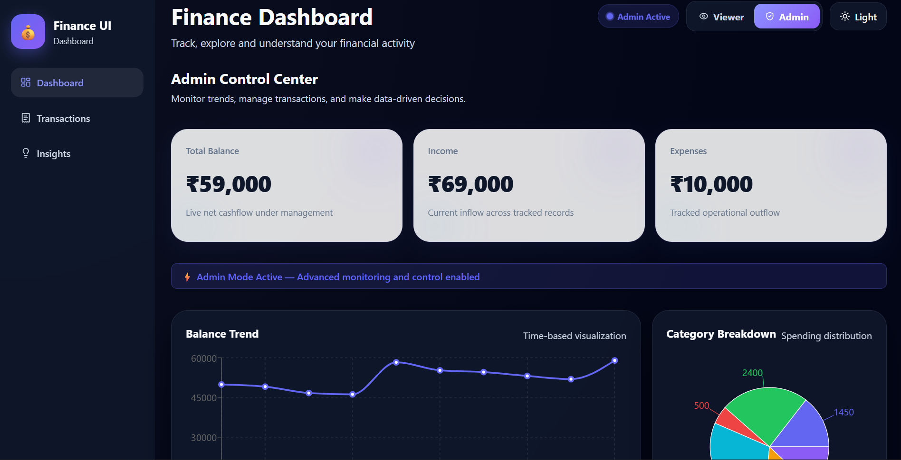
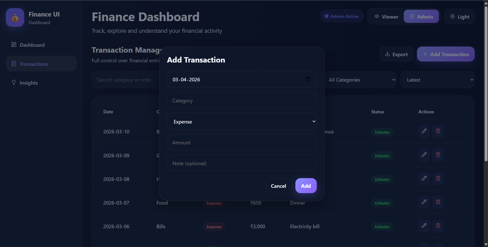
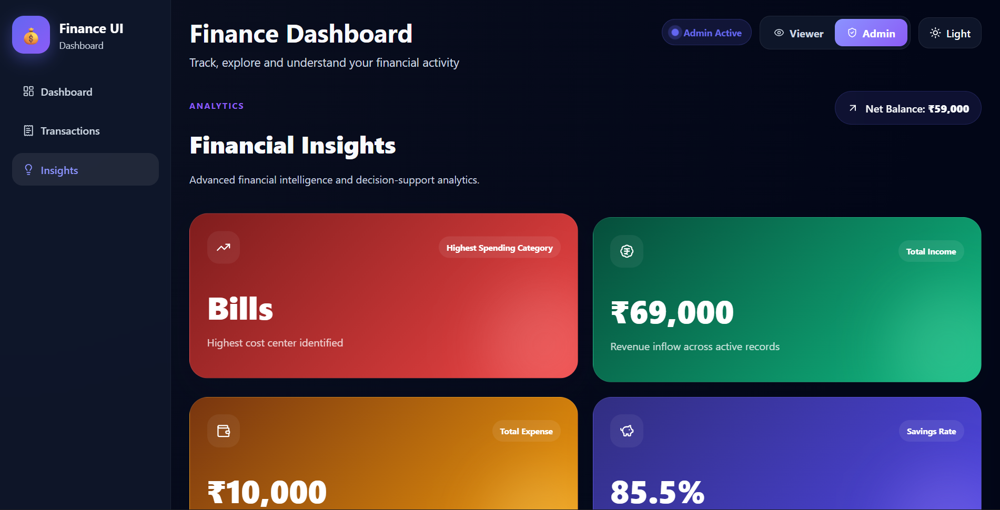

# Finance Dashboard UI

A clean, responsive, and interactive **Finance Dashboard** built as a frontend assignment.  
The project focuses on **financial data visualization, transaction management, role-based UI behavior, and user-friendly dashboard design** using static/mock data.

---

## Project Overview

This project simulates a simple finance dashboard where users can:

- View their financial summary
- Track income and expenses
- Explore transactions
- Understand spending behavior through insights
- Experience different UI behavior based on role (**Viewer / Admin**)

The goal was to create a **clear, interactive, and polished frontend interface** with a strong focus on usability, responsiveness, and component structure.

---

## Features

### 1. Dashboard Overview
- Summary cards for:
  - **Total Balance**
  - **Income**
  - **Expenses**
- **Time-based chart** for balance trend
- **Category-wise chart** for spending breakdown
- Admin-only enhanced monitoring section

### 2. Transactions Section
- View all transactions in a structured table
- Includes:
  - Date
  - Category
  - Type
  - Amount
- Supports:
  - Search
  - Filtering
  - Sorting
  - Export
- **Admin role** can:
  - Add transactions
  - Edit transactions
  - Delete transactions
- **Viewer role** has read-only access

### 3. Insights Section
- Displays useful financial observations such as:
  - Highest spending category
  - Total income
  - Total expense
  - Savings rate
- Admin mode shows enhanced insight presentation

### 4. Role-Based UI
This project includes **basic frontend role simulation**:

#### Viewer
- Read-only access
- Can explore data and charts
- Cannot modify transactions

#### Admin
- Can manage transactions
- Sees extra dashboard and insight-level monitoring sections

### 5. UI / UX Enhancements
- Responsive layout across screen sizes
- Light / Dark mode
- Interactive cards and polished layout
- Clean and readable visual hierarchy
- Handles data display cleanly for a frontend-only app

---

## Approach

The project was built with a **component-based frontend structure** to keep the code organized, reusable, and easy to maintain.

### Main implementation decisions:
- Used **React + Vite** for a fast frontend workflow
- Used **Zustand** for lightweight state management
- Used **Recharts** for financial visualizations
- Used **Lucide React** for icons and UI polish
- Used **mock/static transaction data** as required
- Focused on:
  - readability
  - responsiveness
  - simple but meaningful interactivity
  - clean role-based behavior

The app is designed to feel like a small but polished financial product rather than only a raw assignment submission.

---

## Tech Stack

- **React**
- **Vite**
- **Zustand**
- **Recharts**
- **Lucide React**
- **CSS**

---

## Project Structure

```bash
finance-dashboard-ui/
│
├── public/
│   └── favicon.svg
│
├── src/
│   ├── assets/
│   ├── components/
│   │   ├── layout/
│   │   ├── cards/
│   │   ├── charts/
│   │   ├── transactions/
│   │   └── ui/
│   │
│   ├── data/
│   │   └── transactions.js
│   │
│   ├── pages/
│   │   ├── Dashboard.jsx
│   │   ├── Transactions.jsx
│   │   └── Insights.jsx
│   │
│   ├── store/
│   │   └── useFinanceStore.js
│   │
│   ├── utils/
│   │   ├── format.js
│   │   ├── insights.js
│   │   ├── filters.js
│   │   └── export.js
│   │
│   ├── App.jsx
│   ├── main.jsx
│   └── index.css
│
├── package.json
├── vite.config.js
└── README.md
```

---

## Setup Instructions

### 1. Clone the project
```bash
git clone <https://github.com/Prathikx/finance-dashboard-ui>
cd finance-dashboard-ui
```

### 2. Install dependencies
```bash
npm install
```

### 3. Start the development server
```bash
npm run dev
```

### 4. Open in browser
```bash
http://localhost:5173
```
### Live Demo
[View Live Project](https://finance-dashboard-ui-wheat-six.vercel.app/)

---

## How State is Managed

The application uses **Zustand** to manage frontend state such as:

- transaction list
- selected role
- filters
- UI-related interactions

This keeps the project simple and lightweight while still making the app easy to scale.

---

## Role Behavior

This project does **not** implement backend authentication or real RBAC.  
Instead, role behavior is **simulated on the frontend** to demonstrate how UI and interactions can change depending on the user role.

### Viewer:
- Can only view information

### Admin:
- Can manage transaction records
- Sees enhanced control/monitoring UI

---

## Optional Enhancements Included

The following optional enhancements were included to strengthen the submission:

- Dark mode
- Export functionality
- Role-based UI behavior
- Interactive visual polish
- Responsive design improvements
- Admin-focused enhancements on Dashboard and Insights

---

## Assumptions

- This is a **frontend-focused assignment**
- No backend/API/database is required
- Transaction data is mock/static
- Role-based behavior is intentionally simulated in the UI

---

## Summary

This project was built with the goal of delivering a **clean, functional, and polished finance dashboard interface** that demonstrates:

- frontend structuring
- UI thinking
- state management
- responsiveness
- interactive dashboard design

The focus was not only on meeting the assignment requirements, but also on making the interface feel more complete and user-friendly.

## 📸 Preview

### Dashboard Overview


### Transactions Management


### Insights & Analytics


### Responsive Mobile View

---